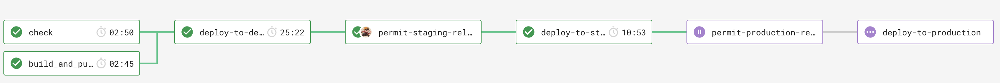

# Resident Contact API

Resident Contact API allows access to saved contact details (inc. mobile, uprn, email) for residents that we have stored.

The contact details can be retrieved through the use of a GET Endpoint which will return all the data or a specific Id too.

## Stack

- .NET Core as a web framework.
- nUnit as a test framework.

## Contributing

### Setup

1. Install [Docker][docker-download].
2. Install [AWS CLI][AWS-CLI].
3. Clone this repository.

### Development

To serve the application, run it using your IDE of choice, we use Visual Studio CE and JetBrains Rider on Mac.

The application can also be served locally using docker:
1.  Add you security credentials to AWS CLI.
```sh
$ aws configure
```
2. Log into AWS ECR.
```sh
$ aws ecr get-login --no-include-email
```
3. Build and serve the application. It will be available in the port 3000.
```sh
$ make build && make serve
```

### Release process

We use a pull request workflow, where changes are made on a branch and approved by one or more other maintainers before the developer can merge into `master` branch.



Then we have an automated six step deployment process, which runs in CircleCI.

1. Automated tests (nUnit) are run to ensure the release is of good quality.
2. The application is deployed to development automatically, where we check our latest changes work well.
3. We manually confirm a staging deployment in the CircleCI workflow once we're happy with our changes in development.
4. The application is deployed to staging.
5. We manually confirm a production deployment in the CircleCI workflow once we're happy with our changes in staging.
6. The application is deployed to production.

Our staging and production environments are hosted by AWS. We would deploy to production per each feature/config merged into  `master`  branch.

## Static Code Analysis

### Using [FxCop Analysers](https://www.nuget.org/packages/Microsoft.CodeAnalysis.FxCopAnalyzers)

FxCop runs code analysis when the Solution is built.

Both the API and Test projects have been set up to **treat all warnings from the code analysis as errors** and therefore, fail the build.

However, we can select which errors to suppress by setting the severity of the responsible rule to none, e.g `dotnet_analyzer_diagnostic.<Category-or-RuleId>.severity = none`, within the `.editorconfig` file.
Documentation on how to do this can be found [here](https://docs.microsoft.com/en-us/visualstudio/code-quality/use-roslyn-analyzers?view=vs-2019).

## Adding a migration

For this API we have a database in RDS, we are using EF Core Code first migrations to manage the schema for this database.
To make changes to the database structure follow these steps.

1, If you haven't done so previously, you need to install the [dotnet ef cli tool](https://docs.microsoft.com/en-us/ef/core/miscellaneous/cli/dotnet) by running `dotnet tool install --global dotnet-ef`.
2, Make the necessary changes to the database model in the code, namely in `ResidentContactContext` or any of the DbSet's listed in the file.
3, In your terminal navigate to the project root folder and run `dotnet ef migrations add -o ./V1/Infrastructure/Migrations -p ResidentContactApi NameOfThisMigration` to create the migration files. NameOfThisMigration should be replaced with your migration name e.g. AddColumnNameToPeopleTable.
4, Go to the folder /ResidentContactApi/V1/Infrastructure/Migrations and you should see two new files for the migration. In the one which doesn't end in `.Designer` you can check through the migration script to make sure everything is being created as you expect.
5, If the migration file looks wrong or you have missed something, you can either run `CONNECTION_STRING="Host=127.0.0.1;Database=testdb;Username=postgres;Password=mypassword;" dotnet ef migrations remove -p ResidentContactApi` with the database in the connection string running or just delete the migration files and revert the changes to `ResidentContactContextModelSnapshot.cs`. Make the necessary changes to the context, then create the migration files again.

Note: You must not change any DbSet that is listed in `ResidentContactContext` without creating a migration as the change then won't be reflected in the database and will cause errors.

## Testing

### Run the tests

```sh
$ make test
```

To run database tests locally (e.g. via Visual Studio) the `CONNECTION_STRING` environment variable will need to be populated with:

`Host=localhost;Database=entitycore;Username=postgres;Password=mypassword"`

Note: The Host name needs to be the name of the stub database docker-compose service, in order to run tests via Docker.

### Agreed Testing Approach
- Use nUnit, FluentAssertions and Moq
- Always follow a TDD approach
- Tests should be independent of each other
- Gateway tests should interact with a real test instance of the database
- Test coverage should never go down
- All use cases should be covered by E2E tests
- Optimise when test run speed starts to hinder development
- Unit tests and E2E tests should run in CI
- Test database schemas should match up with production database schema
- Have integration tests which test from the PostgreSQL database to API Gateway

## Data Migrations
### A good data migration
- Record failure logs
- Automated
- Reliable
- As close to real time as possible
- Observable monitoring in place
- Should not affect any existing databases

## Contacts

### Active Maintainers

- **Selwyn Preston**, Lead Developer at London Borough of Hackney (selwyn.preston@hackney.gov.uk)
- **Mirela Georgieva**, Lead Developer at London Borough of Hackney (mirela.georgieva@hackney.gov.uk)
- **Matt Keyworth**, Lead Developer at London Borough of Hackney (matthew.keyworth@hackney.gov.uk)

### Other Contacts

- **Rashmi Shetty**, Product Owner at London Borough of Hackney (rashmi.shetty@hackney.gov.uk)

[docker-download]: https://www.docker.com/products/docker-desktop
[universal-housing-simulator]: https://github.com/LBHackney-IT/lbh-universal-housing-simulator
[made-tech]: https://madetech.com/
[AWS-CLI]: https://aws.amazon.com/cli/
